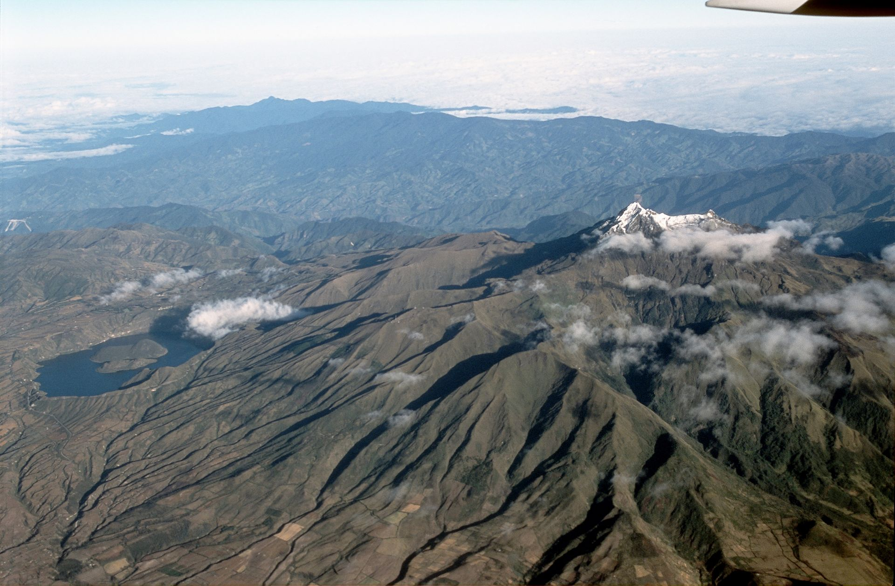

## Welcome! & Hello!

### About me
I am a citizen of the South America Andes/Amazon. I grew up speaking one Amazon language and two Andes languages. About seven years ago, I learned Spanish and Portuguese, and around five years ago, I started to study English. At present, I move all efforts to master programming languages.

### Motivations
A passion for science brought me to the US, where I developed an interest in the business. I want to master programming languages like Python, R, SQL, and JavaScript, which I can apply in AgriTech research and product development. I care about utilizing technology to fight food insecurity and access to education. I used everything I learned about business to structure a project in the Andes community, offering tutorial programs to indigenous youth with little to no access to a school system. Furthermore, I work to establish agricultural training for Andes farmers and tech tools to measure carbon dioxide. A sense of social contract and professional aspiration drive my motivation and desire to form part of the Innovation Fellowship. It is with professionalism and advance in education that we can create game-changing social impacts.  Since I just launch my programming path, I believe that the fellowship community will provide the necessary support to succeed in tech, a field to which a small number of people of color have made breakthroughs. Insignificant part, I apply to the fellowship for personal and career growth; however, I am confident growth in these areas will prepare me to continue giving back to communities of color.

### Home

### Link
[K'allam'p](https://www.facebook.com/Kallamp-102911618117932/?modal=admin_todo_tour)
